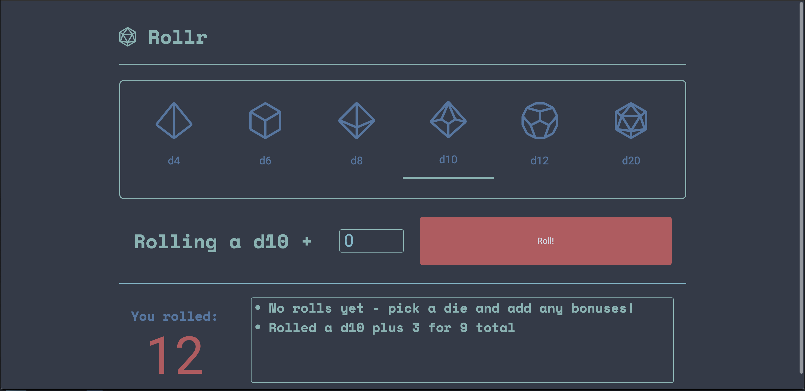

# Rollr - Your First VueJS App!

## Project setup
### Requirements
- Node v12 or above
- Yarn ‘$ npm i -g yarn’
### Installing dependencies
```
yarn install
```

### Compiles and hot-reloads for development
```
yarn serve
```

### Compiles and minifies for production
```
yarn build
```

### Run your unit tests
```
yarn test:unit
```

### Lints and fixes files
```
yarn lint
```

### Customize configuration
See [Configuration Reference](https://cli.vuejs.org/config/).
